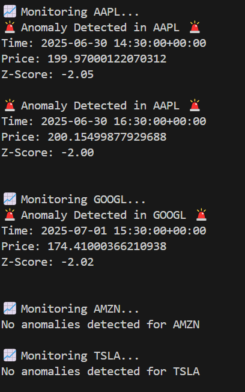
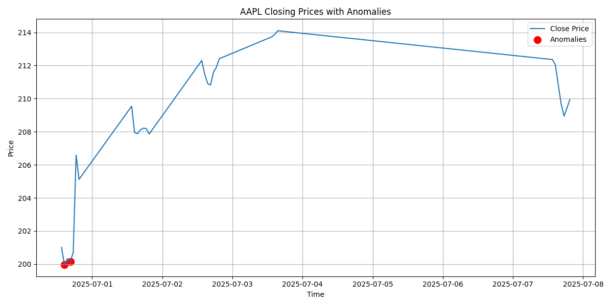
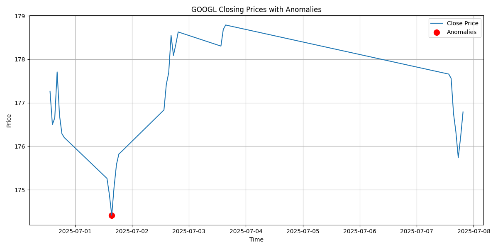

# Real-time Stock Price Anomaly Detector

A Python application that monitors real-time stock prices for multiple stocks, detects unusual price movements (anomalies) using Z-score based statistical analysis, and visualizes the anomalies on price charts.


## Features

- Fetches historical stock price data using [yfinance](https://github.com/ranaroussi/yfinance).
- Processes hourly price data for multiple stocks (AAPL, GOOGL, AMZN, TSLA).
- Detects anomalies based on Z-score thresholding.
- Prints alert messages for detected anomalies.
- Visualizes closing prices with anomalies marked using Matplotlib.
- Modular code structure for easy maintenance and extension.


## Requirements

- Python 3.7+
- pandas
- numpy
- yfinance
- matplotlib

Install dependencies with:

```bash
pip install -r requirements.txt
````


## Usage

Run the main script to start monitoring stocks:

```bash
python main.py
```

The script fetches hourly data for the past 5 days, detects anomalies, prints alerts, and plots charts highlighting anomalies. It repeats every hour.


## Output Example



📊 Visualization of stock price with anomalies marked:




## Project Structure

```
stock_anomaly_detector/
│
├── api_client.py         # Fetches stock data using yfinance
├── preprocessing.py      # Prepares data for anomaly detection
├── anomaly_detector.py   # Implements anomaly detection logic
├── alert_system.py       # Sends alerts to console
├── plotting.py           # Plots price charts and anomalies
├── main.py               # Runs the monitoring pipeline
├── requirements.txt      # Python dependencies
└── README.md             # Project documentation
```


## Author

Anil Jyothi Athira — [22211a0518@bvrit.ac.in)


